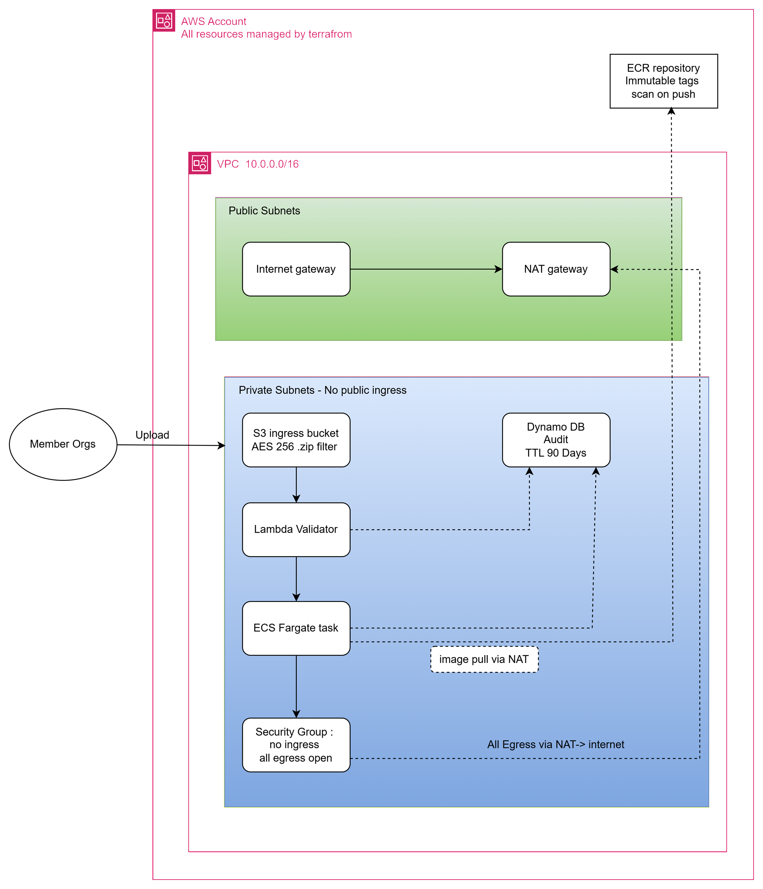

# 🌟 Uni-Heidelberg Dataworks

[](https://aws.amazon.com/)
[](https://www.terraform.io/)
[](https://www.python.org/)

> A serverless data ingestion and processing pipeline implemented with AWS Lambda, Amazon ECS Fargate, DynamoDB, and Terraform for infrastructure as code.

## Table of Contents

1. [Architecture Overview](#architecture-overview)
2. [Prerequisites](#prerequisites)
3. [Getting Started](#getting-started)
4. [Implementation Details](#implementation-details)
5. [Security Best Practices](#security-best-practices)
6. [Workflow](#workflow)
7. [Repository Structure](#repository-structure)
8. [Notes](#notes)
9. [Trade-offs / Future Plans](#trade-offs--future-plans)

## Architecture Overview


The system consists of:

- **Storage Layer**: S3 bucket(s) for data upload.
- **Validation & Orchestration**: Event-driven Lambda functions triggered by S3 upload events.
- **Processing Layer**: Docker container workload executed on Amazon ECS Fargate.
- **Audit Log**: DynamoDB for persistent, queryable audit trail.
- **Infrastructure as Code**: Terraform scripts provision resources with security best practices.

## Prerequisites

Before deploying this project, ensure you have the following:

- **AWS Account**: With appropriate permissions to create resources (IAM, S3, Lambda, ECS, DynamoDB, etc.).
- **Terraform**: Version 1.0+ installed on your local machine.
- **AWS CLI**: Configured with your AWS credentials.
- **Python**: Version 3.8+ for Lambda functions.
- **Docker**: For building and pushing container images to ECR.
## Getting Started

1. **Clone the Repository**:
   ```bash
   git clone https://github.com/anupkumarugalavat/uni-heidelberg-dataworks.git
   cd uni-heidelberg-dataworks
   ```

2. **Configure Terraform Variables**:
   Edit `infra/terraform.tfvars` with your specific values (e.g., AWS region, bucket names).

3. **Initialize Terraform**:
   ```bash
   cd infra
   terraform init
   ```

4. **Plan the Deployment**:
   ```bash
   terraform plan
   ```

5. **Apply the Infrastructure**:
   ```bash
   terraform apply
   ```

6. **Build and Push Docker Image** (if needed):
   ```bash
   cd ../src/processor
   docker build -t your-ecr-repo/processor
   aws ecr get-login-password --region your-region | docker login --username AWS --password-stdin your-ecr-repo
   docker push your-ecr-repo/processor
   ```

7. **Test the Pipeline**:
   Upload a `.zip` file to the S3 bucket and monitor the workflow via DynamoDB and CloudWatch logs.
## Implementation Details

### Infrastructure

- **S3 buckets**: Private and encrypted at rest using S3 SSE.
- **IAM Roles & Policies**:
  - Lambda functions granted least privilege access to S3, DynamoDB, ECS, and Secrets Manager.
  - ECS tasks constrained with minimal access.
- **Lambda functions**:
  - Validation trigger
  - Processing trigger
- **ECS cluster & Fargate task definitions**:
  - Docker image stored in ECR
- **DynamoDB table**: Audit logs and processing status tracking
- **VPC & Security Groups**: Configured for ECS tasks when required
- **Secrets Manager / Parameter Store**: Stores sensitive configuration values securely

## Security Best Practices

- Restrict access with S3 bucket policies
- Use IAM roles with least privilege permissions
- Encrypt data at rest (S3 SSE, DynamoDB encryption)
- Enable CloudTrail for auditing and monitoring

## Workflow

1. **Ingress**
   - A member uploads a `.zip` file to the S3 bucket.

2. **Validation**
   - The upload event triggers the `validate_upload` Lambda function.
   - The Lambda checks the file for required metadata, including `organization-id` and compliance rules.
   - Validation results are stored in DynamoDB with status information.

3. **Execution**
   - If validation passes, a Lambda function triggers an ECS Fargate task.
   - The task runs a containerized process that logs file details such as file name and size.
   - The task updates DynamoDB with start and completion audit records.

4. **Audit**
   - Every workflow transition is recorded in DynamoDB with timestamp, event type, organization ID, and file metadata.

## Repository Structure

```
uni-heidelberg-dataworks/
├── infra/                           # All Terraform files (.tf)
│   ├── database.tf
│   ├── ecs.tf
│   ├── iam.tf
│   ├── lambda.tf
│   ├── main.tf
│   ├── networking.tf
│   ├── outputs.tf
│   ├── storage.tf
│   ├── terraform.tfvars            # Environment specific values
│   └── variables.tf
├── src/
│   ├── lambda/
│   │   └── validator.py
│   └── processor/
│       ├── Dockerfile
│       ├── processor.py
│       └── requirements.txt
└── docs/
    ├── README.md
    └── Hybrid_Strategy.md
```

## Notes

- The project is designed for a secure, event-driven AWS data pipeline.
- Terraform defines and manages all infrastructure resources.
- The audit trail enables traceability for uploads, validation, and processing.

### Does this meet all conditions?
| Requirement | Status | Component |
|-------------|--------|-----------|
| Ingress | ✅ Met | Private S3 Bucket with Encryption |
| Validation | ✅ Met | Lambda with Tag/Metadata checking logic |
| Execution | ✅ Met | Dockerized Processor for ECS Fargate |
| Audit | ✅ Met | DynamoDB for persistent state tracking |
| IaC | ✅ Met | Full Terraform suite provided |
| Security | ✅ Met | IAM Roles and Encryption policies |
| Hybrid Strategy | ✅ Met | Decoupling document (above) |

## Trade-offs / Future Plans

This code is functional, security-first prototype, but to make it "Mission-Critical Production Ready," there are a few architectural enhancements you should implement.
While it follows Security-by-Design and Least Privilege principles, here is what is missing for a true production environment:

### 1. State Management (The "Missing Link")
In the current `main.tf`, the Terraform state is stored locally on your machine.

**Production Requirement**: Use a remote backend (for example, an S3 bucket with DynamoDB state locking). Without this, concurrent `terraform apply` operations can corrupt state.  
**Fix**: Add a `backend "s3" {}` block.

### 2. Encryption Control (KMS)
The current S3 and DynamoDB resources use "Amazon Managed Keys" (AES256).

**Production Requirement**: Regulated industries usually require Customer Managed Keys (CMK) via AWS KMS. This allows you to rotate keys and audit exactly who (or what service) is decrypting data.  
**Fix**: Provision aws_kms_key and point S3/DynamoDB to use that key.

### 3. Networking Optimization (VPC Endpoints)
The current setup uses a NAT Gateway for the ECS tasks to talk to S3 and DynamoDB.

**Production Requirement**: NAT Gateways are expensive and send traffic over the "public" AWS network. You should use VPC Endpoints (Interface and Gateway types). This keeps all data traffic strictly inside the AWS private fiber, reducing costs and latency while increasing security.  
**Fix**: Add aws_vpc_endpoint for S3, DynamoDB, ECR, and CloudWatch.

### 4. Strict IAM Scoping
The `lambda.tf` currently allows `ecs:RunTask` on `Resource = "*"`.

**Production Requirement**: IAM should be scoped to the exact ARN of the ECS Cluster and the specific Task Definition version.  
**Fix**: Replace the wildcard with `${aws_ecs_cluster.main.arn}`.

### 5. Monitoring & Alerting
The code creates log groups but no "eyes" on the system.

**Production Requirement**: You need CloudWatch Alarms. For example, if the Lambda validator fails more than 3 times in 5 minutes, an SNS notification should be sent to your engineering team.  
**Fix**: Add aws_cloudwatch_metric_alarm for Lambda errors and ECS task failures.

### 6. Secrets Management
The scripts currently pass identifiers via environment variables (which is fine).

**Production Requirement**: If you eventually need database passwords or API keys for the "Processor," these should never be in environment variables or Terraform code.  
**Fix**: Use AWS Secrets Manager and inject them into the container at runtime.
